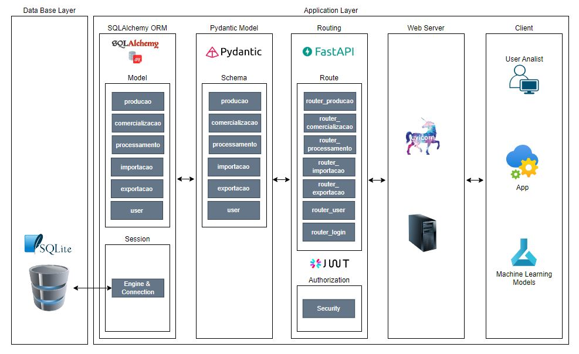

# Tech Challeng FIAP 
> API - Recupera dados de produção, processamento, comercialização, importação
> e exportação diretamente do site da embrapa ([Embrapa Site](http://vitibrasil.cnpuv.embrapa.br)).
> 

## Objetivo? 
> Disponibilizar um canal de acesso para recuperação e armazenamento dos dados de forma
> estruturada, facilitando a utilização desses dados pelas aplicações, equipes de 
> analistas e cientistas de dados.


## Links e Repositórios do Projeto
[Git Hub Project](https://github.com/naldolima/embrapa_api)

[Embrapa Site](http://vitibrasil.cnpuv.embrapa.br)


## Tecnologias Utilizadas:
* Python
* FastAPI
* Uvicorn (server)
* Sqlalchemy
* Sqlite
* Jwt

## Arquitetura do Projeto:


## Como fazer o download e iniciar a aplicação ?
```
git clone https://github.com/naldolima/embrapa_api.git
cd .\embrapa_api\
python -m venv env   #create a virtual environment
.\env\Scripts\activate  #activate your virtual environment
cd .\backend\
pip install -r .\requirements.txt
uvicorn main:app --reload     #start server
visit  127.0.0.1:8000/
```
## Como autenticar com o user admin ?

Via Login:
> * Com a aplicação iniciada acesse http://127.0.0.1:8000/docs
> * clique no botão Authorize
> * Entre com user: user@teste.com e password: xdlE!@LKdabi

Gerar Token:
> * Com a aplicação iniciada acesse http://127.0.0.1:8000/docs
> * acesse http://127.0.0.1:8000/docs#/login/login_for_access_token_token_post
> * clique no botão "Try it out"
> * Entre com username: user@teste.com e password: xdlE!@LKdabi
> * Em seguida clique no botão "Execute"
> * Pronto! seu token foi gerando no response da requisição
 
Utilizar o Token:
> Escolha uma ferramenta de requisição de sua preferencia, 
> como por exemplo: "Postman", e faça uma requisição GET com os 
> seguintes parametros:
> * Escolha o método GET
> * Url: http://127.0.0.1:8000/producao
> * Na opção Authorization ajuste as opções: 
> Type: OAuth 2.0, Current token: coloque o token gerado conforme 
> passo anterior, Header Prefix: Bearer

Temas abordados:
 - ✔️ Serving Template
 - ✔️ Connecting to Database
 - ✔️ Schemas
 - ✔️ Dependency Injection
 - ✔️ Password Hashing
 - ✔️ Authentication login/create user/get token
 - ✔️ Authorization/Permissions